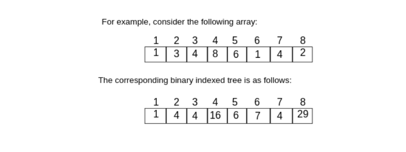
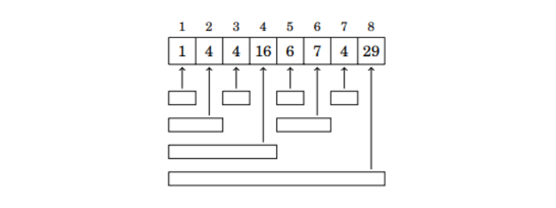

## Fenwick Tree
Fenwick Tree or Binary Indexed Tree is a data structure used when you have an array and you are performing some operation to find a result(operation can be finding minimum,sum etc in the given array) in a given range. It supports two O(logn) time operations on an array:
processing a range sum query and updating a value  
The advantage of a binary indexed tree is that it allows us to efficiently update array values between sum queries. This would not possible using a prefix sum array, because after each update, it would be necessary to build the whole prefix
sum array again in **O(n)** time.   
Let p(k) denote the largest power of two that divides k. We store a binary indexed tree as an array tree such that  

**tree[k] = sum(k − p(k)+1,k),**
 

 
The following picture shows more clearly how each value in the binary indexed
tree corresponds to a range in the original array:
 

 
Using a binary indexed tree, any value of sumq(1,k) can be calculated in
O(logn) time, because a range [1,k] can always be divided into O(logn) ranges
whose sums are stored in the tree.

