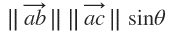
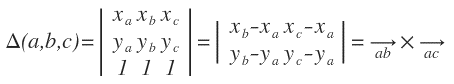
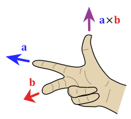
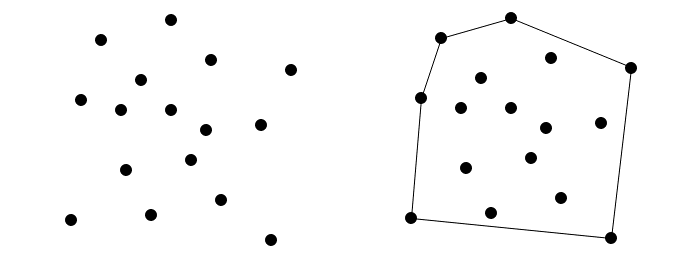
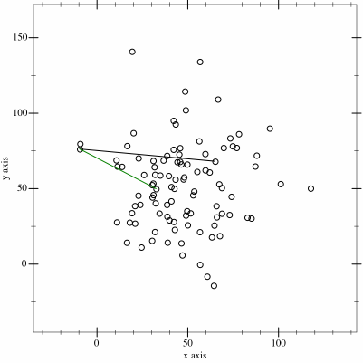

 
    <h3>Jarvis march convex hull alogrithm</h3>

## Content

  - [What is Convex Hull ?](#What-is-Convex-Hull-?)
  - [Orientation of Vectors ](#Orientation-of-Vectors)
  - [Vector positioning relative to a Vector](#Vector-positioning-relative-to-a-Vector)
  - [Convex Hull](#Convex-Hull)
  - [The execution of Jarvis march algorithm](#The-execution-of-Jarvis-march-algorithm)
  - [Practical implementation of Jarvis algorithm](#Practical-implementation-of-Jarvis-algorithm)
  - [Time complexity and space complexity of Jarvis march algorithm](#Time-complexity-and-space-complexity-of-Jarvis-march-algorithm)

## What is Convex Hull ?
1. Convex Hull is the line completely enclosing a set of points in a plane so that there are no concavities in the line. More formally, we can describe it as the smallest convex polygon which encloses a set of points such that each point in the set lies within the polygon or on its perimeter.

2. Find the convex hull of any given set of points.

## Orientation of Vectors 

* Calculating Orientation 
  
  * Three kinds of Orientations 
        
        1. Clockwise (cw):right turn . 
                  
        2. CounterClockwise(CCW):left turn 
        
        3. Collinear (Coll):no turm

**The Orientation can be characterized by sign of Determinant**

* If △(a,b,c)<0 ⇒ clockwise
* If △(a,b,c)=0 ⇒ collinear
* If △(a,b,c)>0 ⇒ counterclock
  
## Vector positioning relative to a Vector

* Cross Product
    * Direction :Right Hand Thumb Rule
    

        
    

    * Magnitude : the area of the parallelogram that vectors span
    

        
    

    * Used to find out the position of vector on left or right in
      Two dimensional space relative to a vector used in(Jarvis March Algorithm)
    

        
    

## Convex Hull

_Formal definition_ : the convex hull of S is the smallest convex polygon that contains all the points of S
    

        
    

## The execution of Jarvis march algorithm

* Jarvis’s march algorithm uses a process called gift wrapping to find the convex hull. 
* It is one of the simplest algorithms for computing convex hull. The working of Jarvis’s march resembles the working of selection sort.
*  In selection sort, in each pass, we find the smallest number and add it to the sorted list. Similarly, in Jarvis’s march, we find the leftmost point and add it to the convex hull vertices in each pass. The step by step working of Jarvis’s march algorithm is given below.
* From the given set of points P, we find a point with minimum x-coordinates ( or leftmost point with reference to the x-axis). Let’s call this point l. Since this point is guaranteed to be in the convex hull, we add this point to the list of convex hull vertices.
* From l, find the leftmost point. For this, we do the following. We select the vertex following l and call it q. We check if q is turning right from the line joining l and every other point one at a time. If q is turning right, we move q to the point from where it was turning right. This way we move q towards left in each iteration and finally stop when q is in the leftmost position from l. We add q to the list of convex hull vertices.
* Now q becomes l and we repeat the step (2).
* Repeat step (2) and (3) until we reach the point where we started.
       
_After the execution of this algorithm, we should get the correct convex hull._

## Practical implementation of Jarvis algorithm

**Use for obstacle avoidance and choose a best possible path.**
    

        
    

## Time complexity and space complexity of Jarvis march algorithm 

1. **Worst case time complexity** : Θ(N ^ 2)
2. **Average case time complexity** : Θ(N log N)
3. **Best case time complexity** : Θ(N log N)
4. **Space complexity** : Θ(N) 

The inner loop checks every point in the set S, and the outer loop repeats for each point on the hull. Hence the total run time is **O(nh)**.
  * **n** : number of points in the system
  * **h** : number of points in the boundary
	The run time depends on the size of the output, so Jarvis's march is an output-sensitive algorithm.
	In worst case, time complexity is **O(n^2)**. The worst case occurs when all the points are on the hull **(h = n)**.